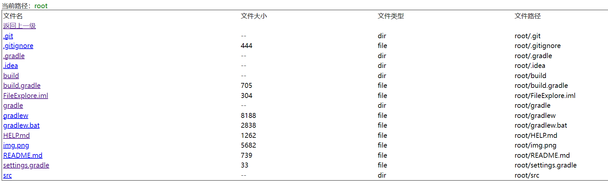

## 文件浏览工具

主要用于部分项目需要从服务器获取文件的情况下，方便下载文件。

## 核心文件

由于没有发布maven,所以需要自己复制代码

- file-expolore.html
- DirConfig
- FileExploreConfig
- FileExploreController
- ServletUtils

以及`application.yml`中的配置`file-explore`

## 配置

```yaml
# 文件浏览配置
file-explore:
  # 是否开启
  open: true
  # 映射的文件夹,可配置多个
  dirs:
    # 映射名字
    - name: root
      # 映射的文件夹,可以是相对路径,/代表部署目录
      path: /
```

## 使用

- 访问`ip:port/file-explore/get?path=xxx`
- 如果path为空,则默认为返回所有映射的文件夹

## 页面



